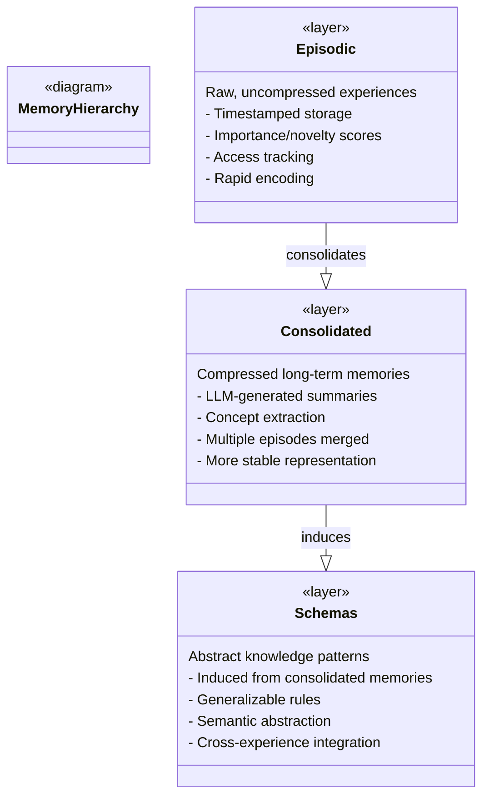
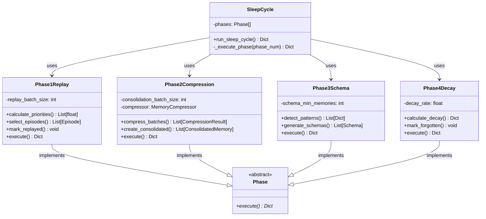
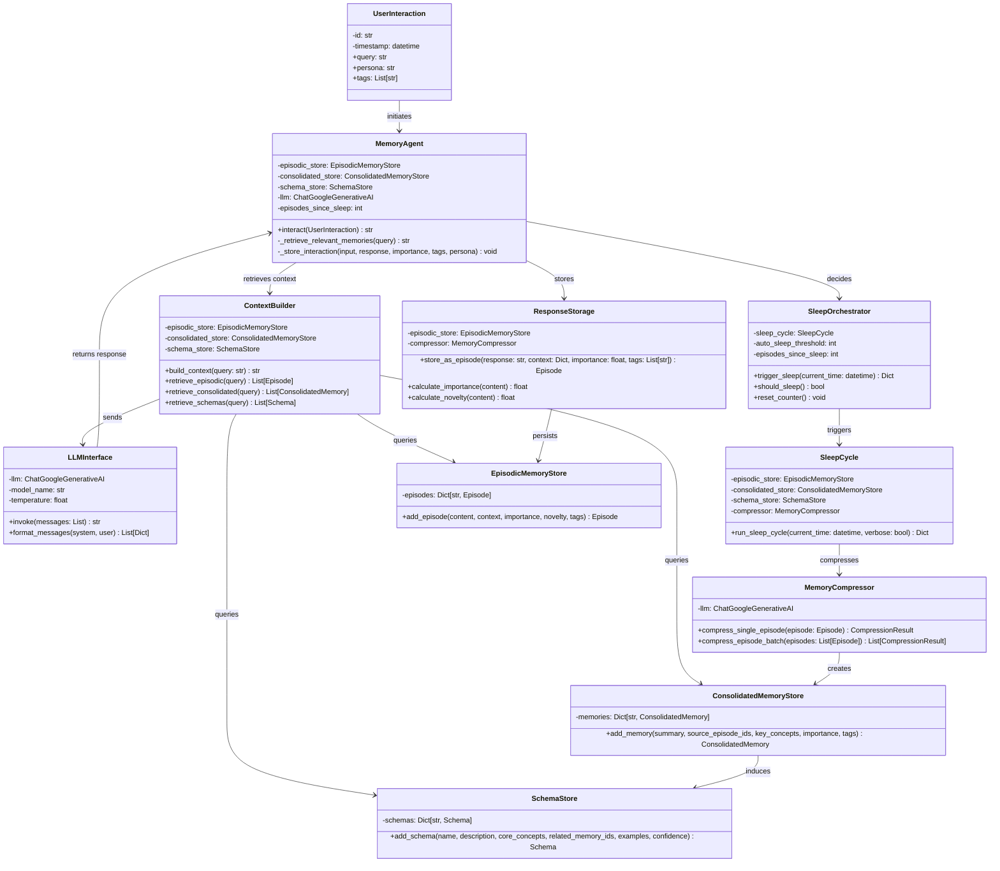
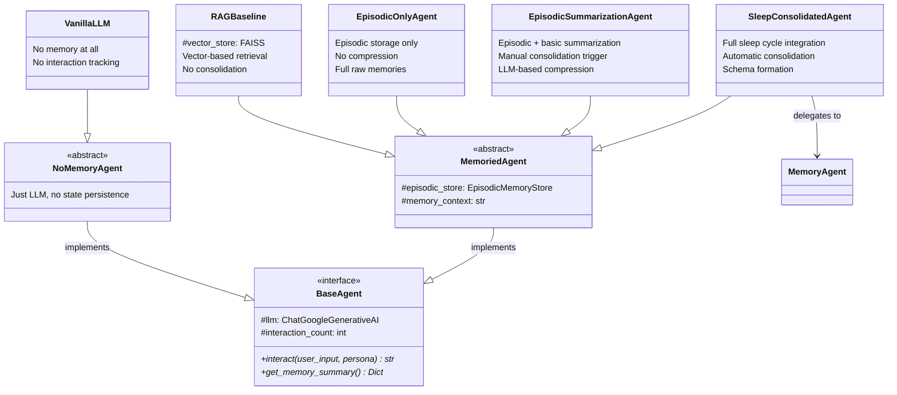
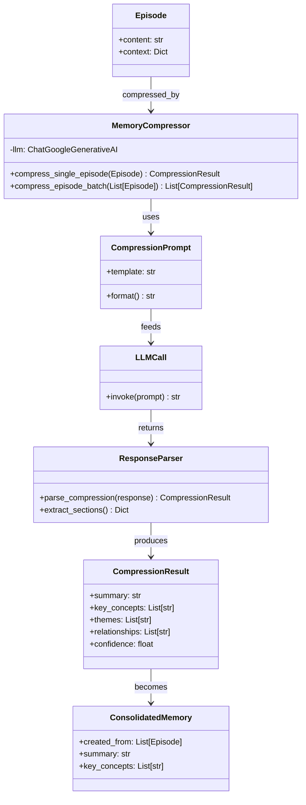

# Class Diagram - Sleep-Inspired Memory System

## System Architecture Overview

The Sleep-Inspired Memory System implements a biologically-plausible memory consolidation architecture that mimics human sleep-dependent memory processing. At its core, the system maintains a three-tier memory hierarchy: an **Episodic Memory Store** for rapid encoding of raw experiences, a **Consolidated Memory Store** for compressed long-term representations, and a **Schema Store** for abstract knowledge patterns. User interactions flow through a **MemoryAgent** that retrieves relevant context from all memory tiers, generates responses via a language model, and stores new experiences as episodes. Periodically, a **SleepCycle** orchestrates offline consolidation through four phases: (1) prioritized replay selects important/novel episodes based on recency, importance, and access patterns; (2) generative compression uses an LLM-based **MemoryCompressor** to summarize episodes into consolidated memories with extracted concepts; (3) schema formation induces generalizable patterns from consolidated memories; and (4) selective forgetting removes low-value episodes. This architecture enables the system to maintain both detailed episodic recall and abstract semantic knowledge, while continuously optimizing memory efficiency through automated consolidation. The evaluation framework benchmarks five baseline methods—ranging from vanilla LLMs with no memory to full sleep-consolidated agents—across task-based metrics (long-horizon QA, multi-session continuity, hallucination rate) and cognitive probes (delayed recall, cue-based recall, cross-episode integration, schema utilization).

## Complete Architecture Class Diagram

```mermaid
classDiagram
    %% DATA CLASSES ==========================================
    class Episode {
        -id: str
        -timestamp: datetime
        +content: str
        +context: Dict[str, Any]
        +importance: float
        +novelty: float
        +access_count: int
        +last_access: Optional[datetime]
        +tags: List[str]
        +consolidated: bool
        +to_dict() Dict
        +from_dict(data) Episode
    }
    
    class ConsolidatedMemory {
        -id: str
        -timestamp: datetime
        +summary: str
        +source_episode_ids: List[str]
        +key_concepts: List[str]
        +importance: float
        +access_count: int
        +last_access: Optional[datetime]
        +tags: List[str]
        +to_dict() Dict
        +from_dict(data) ConsolidatedMemory
    }
    
    class Schema {
        -id: str
        -timestamp: datetime
        +name: str
        +description: str
        +core_concepts: List[str]
        +related_memory_ids: List[str]
        +examples: List[str]
        +confidence: float
        +access_count: int
        +last_access: Optional[datetime]
        +to_dict() Dict
        +from_dict(data) Schema
    }
    
    class CompressionResult {
        +summary: str
        +key_concepts: List[str]
        +themes: List[str]
        +relationships: List[str]
        +confidence: float
    }
    
    %% MEMORY STORES =========================================
    class EpisodicMemoryStore {
        -episodes: Dict[str, Episode]
        +add_episode(content, context, importance, novelty, tags) Episode
        +get_episode(episode_id) Optional[Episode]
        +get_recent(n) List[Episode]
        +get_unconsolidated() List[Episode]
        +mark_accessed(episode_id) void
        +mark_consolidated(episode_id) void
        +get_count() int
        +delete_episode(episode_id) bool
    }
    
    class ConsolidatedMemoryStore {
        -memories: Dict[str, ConsolidatedMemory]
        +add_memory(summary, source_episode_ids, key_concepts, importance, tags) ConsolidatedMemory
        +get_memory(memory_id) Optional[ConsolidatedMemory]
        +search_by_concepts(query_concepts) List[ConsolidatedMemory]
        +get_relevant(query_embedding) List[ConsolidatedMemory]
        +update_memory(memory_id, updates) ConsolidatedMemory
        +delete_memory(memory_id) bool
    }
    
    class SchemaStore {
        -schemas: Dict[str, Schema]
        +add_schema(name, description, core_concepts, related_memory_ids, examples, confidence) Schema
        +get_schema(schema_id) Optional[Schema]
        +find_related_schemas(concepts) List[Schema]
        +merge_schemas(schema_ids) Schema
        +update_schema(schema_id, updates) Schema
        +delete_schema(schema_id) bool
    }
    
    %% MEMORY COMPRESSION ====================================
    class MemoryCompressor {
        -api_key: str
        -llm: ChatGoogleGenerativeAI
        -model_name: str
        -temperature: float
        +compress_single_episode(episode) CompressionResult
        +compress_episode_batch(episodes) List[CompressionResult]
        +extract_concepts_from_text(text) List[str]
        -_parse_compression_response(response_text) CompressionResult
        -_ensure_text(value) str
    }
    
    %% REPLAY & CONSOLIDATION ================================
    class ReplayModule {
        +calculate_replay_priority(episode, current_time, weights) float
        +select_episodes_for_replay(episodes, n_replay, weights) List[Tuple[Episode, float]]
        +select_diverse_batch(episodes, n_batch) List[Episode]
    }
    
    class SleepCycle {
        -episodic_store: EpisodicMemoryStore
        -consolidated_store: ConsolidatedMemoryStore
        -schema_store: SchemaStore
        -compressor: MemoryCompressor
        -replay_batch_size: int
        -consolidation_batch_size: int
        -schema_min_memories: int
        -cycle_count: int
        -total_consolidated: int
        -total_schemas_formed: int
        +run_sleep_cycle(current_time, verbose) Dict
        -_phase_1_replay(current_time, verbose) Dict
        -_phase_2_consolidation(replayed_episodes, verbose) Dict
        -_phase_3_schema_formation(verbose) Dict
        -_phase_4_decay(verbose) Dict
    }
    
    %% CORE AGENT ============================================
    class MemoryAgent {
        -api_key: str
        -llm: ChatGoogleGenerativeAI
        -episodic_store: EpisodicMemoryStore
        -consolidated_store: ConsolidatedMemoryStore
        -schema_store: SchemaStore
        -compressor: MemoryCompressor
        -sleep_cycle: SleepCycle
        -conversation_history: List[Dict]
        -interaction_count: int
        -auto_sleep_threshold: int
        -episodes_since_sleep: int
        +interact(user_input, importance, tags, use_memory, persona) str
        -_retrieve_relevant_memories(user_input) str
        -_build_system_prompt(memory_context, persona) str
        -_store_interaction(user_input, response, importance, tags, persona) void
        +perform_sleep() Dict
        +get_memory_summary() Dict
        -_ensure_text(value) str
    }
    
    %% BASELINE METHODS ======================================
    class VanillaLLM {
        -api_key: str
        -llm: ChatGoogleGenerativeAI
        -interaction_count: int
        +interact(user_input, persona) str
        +get_memory_summary() Dict
    }
    
    class RAGBaseline {
        -api_key: str
        -llm: ChatGoogleGenerativeAI
        -vector_store: FAISS
        -embeddings: GoogleGenerativeAIEmbeddings
        -interaction_count: int
        -top_k: int
        +interact(user_input, persona) str
        +get_memory_summary() Dict
        -_add_to_vector_store(text) void
        -_retrieve_similar(query) List[str]
    }
    
    class EpisodicOnlyAgent {
        -api_key: str
        -llm: ChatGoogleGenerativeAI
        -episodic_store: EpisodicMemoryStore
        -interaction_count: int
        +interact(user_input, persona) str
        +get_memory_summary() Dict
        -_retrieve_episodic_context(query) str
    }
    
    class EpisodicSummarizationAgent {
        -api_key: str
        -llm: ChatGoogleGenerativeAI
        -episodic_store: EpisodicMemoryStore
        -compressor: MemoryCompressor
        -interaction_count: int
        -consolidation_threshold: int
        +interact(user_input, persona) str
        +get_memory_summary() Dict
        -_retrieve_and_summarize(query) str
        -_consolidate_old_episodes() void
    }
    
    class SleepConsolidatedAgent {
        -api_key: str
        -memory_agent: MemoryAgent
        -interaction_count: int
        -sleep_interval: int
        -interaction_since_sleep: int
        +interact(user_input, persona) str
        +perform_sleep() Dict
        +get_memory_summary() Dict
    }
    
    %% EVALUATION ============================================
    class PersonaMemEvaluator {
        -api_key: str
        -llm: ChatGoogleGenerativeAI
        +evaluate_long_horizon_qa(response, correct_answer, incorrect_answers) Dict
        +evaluate_multi_session_continuity(responses, sessions) Dict
        +evaluate_hallucination_rate(responses) Dict
        +evaluate_delayed_recall(pre_responses, post_responses) Dict
        +evaluate_cue_based_recall(responses, cues) Dict
        +evaluate_cross_episode_integration(responses) Dict
        +evaluate_schema_utilization(responses, schemas) Dict
        -_ensure_text(value) str
        -_ensure_list(value) List[str]
    }
    
    class BenchmarkRunner {
        -split: str
        -num_samples: int
        -methods: List[str]
        -output_dir: Path
        -data_dir: Path
        -samples: List[Dict]
        -persona_groups: Dict[int, List[Dict]]
        -evaluator: PersonaMemEvaluator
        +run_table1_evaluation(method) Dict
        +run_table2_evaluation() Dict
        +run_all_benchmarks() Dict
        -_load_data() List[Dict]
        -_load_persona_groups() Dict
        -_save_results(results) void
        -_export_csv(table_name, results) void
    }
    
    %% UTILITY FUNCTIONS =====================================
    class BenchmarkUtils {
        +create_agent(method_name) BaseAgent
        +aggregate_results(results) Dict
        +calculate_statistics(scores) Dict
        +format_results_table(results) str
    }
    
    %% RELATIONSHIPS =========================================
    
    %% MemoryAgent composition
    MemoryAgent --> EpisodicMemoryStore : uses
    MemoryAgent --> ConsolidatedMemoryStore : uses
    MemoryAgent --> SchemaStore : uses
    MemoryAgent --> SleepCycle : orchestrates
    MemoryAgent --> MemoryCompressor : uses
    
    %% SleepCycle composition
    SleepCycle --> EpisodicMemoryStore : reads/updates
    SleepCycle --> ConsolidatedMemoryStore : writes
    SleepCycle --> SchemaStore : writes
    SleepCycle --> MemoryCompressor : uses
    SleepCycle --> ReplayModule : uses
    
    %% Memory store relationships
    EpisodicMemoryStore --> Episode : manages
    ConsolidatedMemoryStore --> ConsolidatedMemory : manages
    SchemaStore --> Schema : manages
    MemoryCompressor --> CompressionResult : produces
    
    %% Baseline agents
    SleepConsolidatedAgent --> MemoryAgent : wraps
    EpisodicOnlyAgent --> EpisodicMemoryStore : uses
    EpisodicSummarizationAgent --> EpisodicMemoryStore : uses
    EpisodicSummarizationAgent --> MemoryCompressor : uses
    RAGBaseline --> FAISS : uses
    
    %% Evaluation
    BenchmarkRunner --> PersonaMemEvaluator : uses
    BenchmarkRunner --> BenchmarkUtils : uses
    PersonaMemEvaluator --> ChatGoogleGenerativeAI : uses for LLM-as-judge
    
    %% Inheritance/Implementation patterns
    VanillaLLM --|> BaseAgent
    RAGBaseline --|> BaseAgent
    EpisodicOnlyAgent --|> BaseAgent
    EpisodicSummarizationAgent --|> BaseAgent
    SleepConsolidatedAgent --|> BaseAgent
    
    class BaseAgent {
        <<interface>>
        +interact(user_input, persona) str*
        +get_memory_summary() Dict*
    }
```

## Detailed Memory Hierarchy

## Sleep Cycle Phase Architecture

## Evaluation Metrics Hierarchy

```mermaid
classDiagram
    class Metric {
        <<abstract>>
        +evaluate() Dict*
        -_ensure_text(value) str*
    }
    
    class Table1Metric {
        <<abstract>>
        Task-Based Performance
    }
    
    class LongHorizonQA {
        +semantic_matching: bool
        +evaluate(response, correct, incorrect) Dict
    }
    
    class MultiSessionContinuity {
        +reference_check: bool
        +evaluate(responses, session_history) Dict
    }
    
    class HallucinationRate {
        +claim_validation: bool
        +evaluate(responses) Dict
    }
    
    class Table2Metric {
        <<abstract>>
        Cognitive Probes (Before/After)
    }
    
    class DelayedRecall {
        +temporal_delay: int
        +evaluate(pre_response, post_response) Dict
    }
    
    class CueBasedRecall {
        +cue_type: str
        +evaluate(pre_response, post_response, cue) Dict
    }
    
    class CrossEpisodeIntegration {
        +evaluate(pre_response, post_response) Dict
    }
    
    class SchemaUtilization {
        +evaluate(pre_response, post_response, schemas) Dict
    }
    
    LongHorizonQA --|> Table1Metric : implements
    MultiSessionContinuity --|> Table1Metric : implements
    HallucinationRate --|> Table1Metric : implements
    
    DelayedRecall --|> Table2Metric : implements
    CueBasedRecall --|> Table2Metric : implements
    CrossEpisodeIntegration --|> Table2Metric : implements
    SchemaUtilization --|> Table2Metric : implements
    
    class PersonaMemEvaluator {
        -metrics: Metric[]
        -llm: ChatGoogleGenerativeAI
        +evaluate_all() Dict
    }
    
    PersonaMemEvaluator --> LongHorizonQA : uses
    PersonaMemEvaluator --> MultiSessionContinuity : uses
    PersonaMemEvaluator --> HallucinationRate : uses
    PersonaMemEvaluator --> DelayedRecall : uses
    PersonaMemEvaluator --> CueBasedRecall : uses
    PersonaMemEvaluator --> CrossEpisodeIntegration : uses
    PersonaMemEvaluator --> SchemaUtilization : uses
```

## Data Flow Through Classes

## Baseline Method Inheritance & Composition

## Compression Pipeline Architecture

