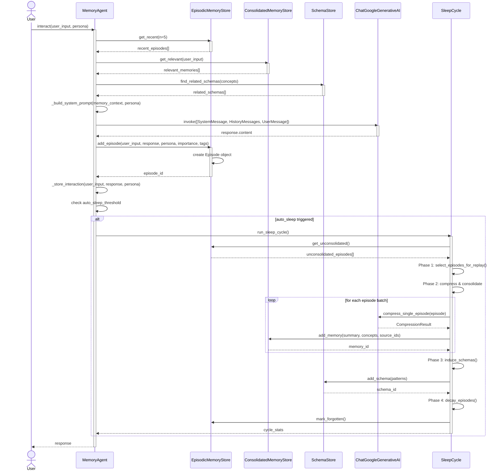
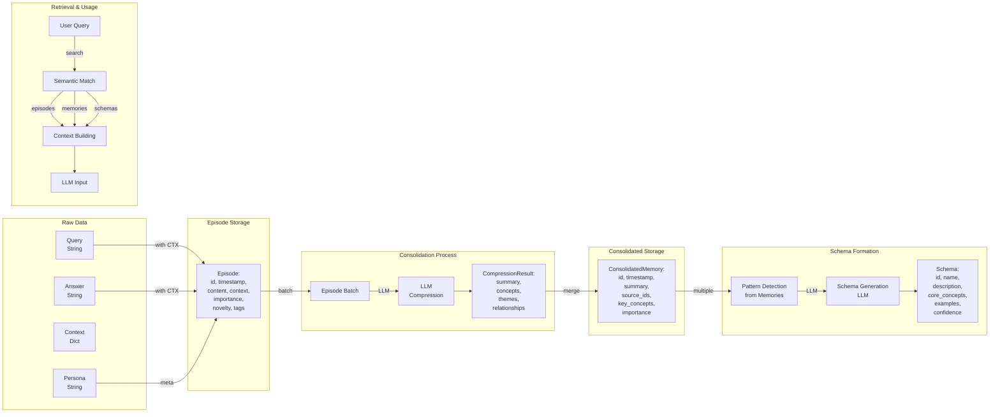
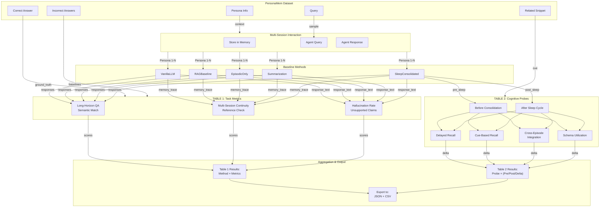

# Data Flow Diagram - Sleep-Inspired Memory System

## Complete Data Flow Architecture

```mermaid
graph TB
    subgraph User["User Input Layer"]
        UI["User Query/Input"]
    end
    
    subgraph Agent["MemoryAgent - Core Processing"]
        AGI["interact()"]
        SYS["_build_system_prompt()"]
        RET["_retrieve_relevant_memories()"]
        STI["_store_interaction()"]
        ASL["Auto-Sleep Check"]
    end
    
    subgraph Retrieval["Memory Retrieval"]
        EPI_GET["get_recent()"]
        CON_GET["get_relevant()"]
        SCH_GET["find_related_schemas()"]
        MEM_CTX["Memory Context\nBuilder"]
    end
    
    subgraph Memory["Memory Storage Layer"]
        EPI_STORE["EpisodicMemoryStore"]
        EPI_DATA["Episodes Dictionary"]
        
        CON_STORE["ConsolidatedMemoryStore"]
        CON_DATA["Consolidated\nMemories Dictionary"]
        
        SCH_STORE["SchemaStore"]
        SCH_DATA["Schemas Dictionary"]
    end
    
    subgraph Episode["Episode Data"]
        EP["Episode Object:<br/>- id: UUID<br/>- timestamp<br/>- content: str<br/>- context: Dict<br/>- importance: float<br/>- novelty: float<br/>- access_count: int<br/>- tags: List"]
    end
    
    subgraph Consolidated["Consolidated Data"]
        CD["ConsolidatedMemory:<br/>- id: UUID<br/>- timestamp<br/>- summary: str<br/>- source_episode_ids<br/>- key_concepts<br/>- importance<br/>- access_count"]
    end
    
    subgraph Schema["Schema Data"]
        SD["Schema Object:<br/>- id: UUID<br/>- name: str<br/>- description<br/>- core_concepts<br/>- related_memory_ids<br/>- examples<br/>- confidence"]
    end
    
    subgraph LLM["LLM Processing"]
        LLM_REQ["ChatGoogleGenerativeAI<br/>invoke()"]
        SYS_MSG["System Message"]
        CONV_HIST["Conversation History<br/>Last 5 turns"]
        RESP["LLM Response"]
    end
    
    subgraph Sleep["Sleep Consolidation Pipeline"]
        SC["SleepCycle"]
        
        P1["Phase 1:<br/>Prioritized Replay"]
        P1_SELECT["select_episodes_for_replay()"]
        P1_MARK["mark_accessed()"]
        
        P2["Phase 2:<br/>Compression & Consolidation"]
        P2_COMPRESS["compress_single_episode() /<br/>compress_episode_batch()"]
        P2_ADD["add_memory()"]
        
        P3["Phase 3:<br/>Schema Formation"]
        P3_INDUCE["induce_schema()"]
        P3_ADD_SCH["add_schema()"]
        
        P4["Phase 4:<br/>Forgetting & Decay"]
        P4_DECAY["decay_episodes()"]
    end
    
    subgraph Compression["Memory Compression"]
        COMP["MemoryCompressor"]
        COMP_PROMPT["LLM Prompt:<br/>Summarize + Extract"]
        PARSE["_parse_compression_response()"]
        RESULT["CompressionResult:<br/>- summary<br/>- key_concepts<br/>- themes<br/>- relationships<br/>- confidence"]
    end
    
    subgraph Replay["Replay Priority Calculation"]
        REP["calculate_replay_priority()"]
        REC["Recency Score<br/>exp decay"]
        IMP["Importance Score<br/>from metadata"]
        NOV["Novelty Score<br/>from metadata"]
        ACC["Access Bonus<br/>min(access_count,5)"]
        PRIOR["Final Priority Score"]
    end
    
    subgraph Evaluation["Evaluation Framework"]
        EVALUATOR["PersonaMemEvaluator"]
        E1["evaluate_long_horizon_qa()"]
        E2["evaluate_multi_session_continuity()"]
        E3["evaluate_hallucination_rate()"]
        E4["evaluate_delayed_recall()"]
        E5["evaluate_cue_based_recall()"]
        E6["evaluate_cross_episode_integration()"]
        E7["evaluate_schema_utilization()"]
    end
    
    subgraph Baselines["Baseline Methods"]
        VAN["VanillaLLM:<br/>No Memory"]
        RAG["RAGBaseline:<br/>Vector Store"]
        EPI["EpisodicOnlyAgent:<br/>Episodic Only"]
        SUMM["EpisodicSummarizationAgent:<br/>Episodic +<br/>Summarization"]
        SLEEP["SleepConsolidatedAgent:<br/>Full Pipeline"]
    end
    
    subgraph Output["Output & Results"]
        RESULTS["Benchmark Results"]
        TABLE1["TABLE 1:<br/>Task-Based Memory"]
        TABLE2["TABLE 2:<br/>Cognitive Probes"]
        JSON["results_TIMESTAMP.json"]
        CSV1["table1_TIMESTAMP.csv"]
        CSV2["table2_TIMESTAMP.csv"]
    end
    
    %% User input flow
    UI -->|user_input| AGI
    
    %% Agent core processing
    AGI -->|retrieve| RET
    RET -->|get_recent| EPI_GET
    RET -->|get_relevant| CON_GET
    RET -->|find_schemas| SCH_GET
    EPI_GET --> MEM_CTX
    CON_GET --> MEM_CTX
    SCH_GET --> MEM_CTX
    MEM_CTX -->|memory_context| SYS
    
    %% System prompt building
    SYS -->|system_prompt| LLM_REQ
    CONV_HIST -->|history| LLM_REQ
    
    %% LLM invocation
    LLM_REQ -->|invoke| RESP
    
    %% Store interaction
    RESP -->|response| STI
    AGI -->|store| STI
    STI -->|add_episode| EPI_STORE
    
    %% Memory storage
    EPI_STORE --> EPI_DATA
    CON_STORE --> CON_DATA
    SCH_STORE --> SCH_DATA
    
    %% Data structures
    EPI_DATA --> EP
    CON_DATA --> CD
    SCH_DATA --> SD
    
    %% Auto-sleep trigger
    STI -->|episode_added| ASL
    ASL -->|if threshold reached| SC
    
    %% Sleep cycle phases
    SC --> P1
    P1 --> P1_SELECT
    P1_SELECT --> P1_MARK
    EPI_GET -->|unconsolidated| P1_SELECT
    
    P1_MARK --> P2
    P2 --> P2_COMPRESS
    P2_COMPRESS -->|episodes| COMP
    
    %% Compression process
    COMP --> COMP_PROMPT
    COMP_PROMPT -->|LLM call| LLM_REQ
    RESP -->|response| PARSE
    PARSE --> RESULT
    RESULT --> P2_ADD
    
    %% Consolidation
    P2_ADD -->|add_memory| CON_STORE
    
    P2 --> P3
    P3 --> P3_INDUCE
    P3_INDUCE -->|patterns| P3_ADD_SCH
    P3_ADD_SCH -->|add_schema| SCH_STORE
    
    P3 --> P4
    P4 --> P4_DECAY
    P4_DECAY -->|mark_forgotten| EPI_STORE
    
    %% Priority calculation
    P1_SELECT --> REP
    EP -->|metadata| REC
    EP -->|metadata| IMP
    EP -->|metadata| NOV
    EP -->|access_count| ACC
    REC -->|weights| PRIOR
    IMP -->|weights| PRIOR
    NOV -->|weights| PRIOR
    ACC -->|weights| PRIOR
    PRIOR --> P1_SELECT
    
    %% Baseline methods
    UI -->|methods| VAN
    UI -->|methods| RAG
    UI -->|methods| EPI
    UI -->|methods| SUMM
    UI -->|methods| SLEEP
    
    SLEEP -->|full_pipeline| SC
    EPI -->|episodic_only| EPI_STORE
    SUMM -->|episodic+compress| EPI_STORE
    RAG -->|vector_db| RAG
    
    %% Evaluation flow
    VAN -->|responses| EVALUATOR
    RAG -->|responses| EVALUATOR
    EPI -->|responses| EVALUATOR
    SUMM -->|responses| EVALUATOR
    SLEEP -->|responses| EVALUATOR
    
    EVALUATOR --> E1
    EVALUATOR --> E2
    EVALUATOR --> E3
    EVALUATOR --> E4
    EVALUATOR --> E5
    EVALUATOR --> E6
    EVALUATOR --> E7
    
    %% Results aggregation
    E1 -->|scores| TABLE1
    E2 -->|scores| TABLE1
    E3 -->|scores| TABLE1
    E4 -->|scores| TABLE2
    E5 -->|scores| TABLE2
    E6 -->|scores| TABLE2
    E7 -->|scores| TABLE2
    
    TABLE1 --> RESULTS
    TABLE2 --> RESULTS
    
    %% Output formats
    RESULTS --> JSON
    RESULTS --> CSV1
    RESULTS --> CSV2
    
```

## Detailed Message Flow for Single Interaction

## Data Structure Transformations

## Benchmark Evaluation Data Flow

