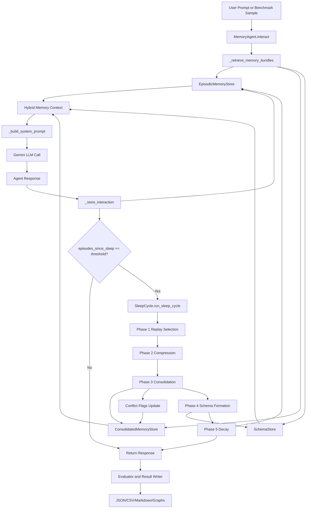
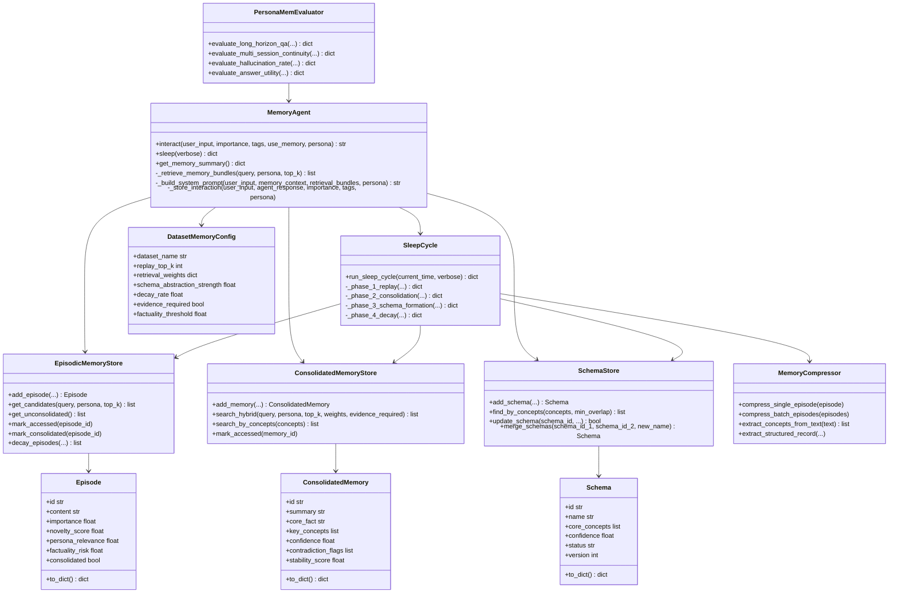

# 4 SYSTEM DESIGN

## 4.1 SYSTEM ARCHITECTURE

This project uses a layered architecture. Each layer has a clear job. This makes the system easier to build, test, and improve.

At the top, we have **input and execution layers**. These include command line runners and the web app. The runner files (`benchmark_runner.py`, `personachat_runner.py`, `locomo_runner.py`, `okvqa_runner.py`) run experiments in batch mode. The Flask app (`public/app.py`) supports interactive chat mode.

In the middle, we have the **agent orchestration layer**. The key class is `MemoryAgent` in `agent/agent.py`. It controls end-to-end behavior. It receives user input, retrieves memory, builds the final prompt, calls the LLM, stores a new episode, and decides when to run sleep consolidation.

Below that, we have the **memory subsystem** with three stores:

1. `EpisodicMemoryStore` (`memory/episodic.py`) for raw recent interactions.
2. `ConsolidatedMemoryStore` (`memory/consolidated.py`) for compressed long-term memories.
3. `SchemaStore` (`memory/schema.py`) for abstract patterns.

These three stores map to the biological idea used in the methodology: fast short-term encoding plus slower long-term abstraction.

Next, we have the **sleep subsystem** in `sleep/`. The class `SleepCycle` in `sleep/consolidation.py` runs the offline consolidation logic. It performs replay selection, compression, consolidation, schema formation, and decay. Replay selection is policy-aware and uses dataset-specific settings from `memory/config.py`.

We also have an **evaluation and reporting layer** in `evaluation/` and `RESEARCH/`. This layer computes metrics, builds tables, and creates graphs. Baselines are defined in `evaluation/baselines.py`. Result files are saved as JSON and CSV. Research markdown files then summarize the results.

Finally, we have a **configuration and utility layer**. This includes dataset-aware memory settings (`memory/config.py`), API usage counters (`utils/api_counter.py`), and environment variable support through `.env`.

### Architecture Goals

- Keep memory logic separate from UI and benchmark scripts.
- Support many datasets with one common agent interface.
- Allow quick ablation testing through config flags.
- Make results reproducible with saved artifacts.
- Keep deployment simple for research and demos.

### High-Level Runtime Flow

1. Input comes from user chat or benchmark sample.
2. Agent retrieves relevant episodic, consolidated, and schema memories.
3. Agent builds system prompt with memory context and conflict guidance.
4. LLM returns a response.
5. Interaction is saved as a new episodic memory.
6. If threshold is reached, sleep cycle runs and updates long-term stores.
7. Evaluator records quality and safety metrics.

This architecture supports online interaction and offline consolidation in one unified design. Memory stability in the consolidated tier is modeled analogously to the synaptic consolidation curve:

$$S(t) = S_0 \cdot e^{-\lambda t} + S_{\infty}$$

---

## 4.2 DESIGN

The design follows simple principles:

- One clear responsibility per module.
- Shared data model across datasets.
- Config-driven behavior instead of hard-coded rules.
- Explicit logging and saved outputs for debugging.

The system is designed to compare five methods in a fair way: `vanilla`, `rag`, `episodic`, `summarization`, and `sleep`. The full model uses the same runner pipeline as baselines. This keeps comparisons consistent.

### 4.2.1 Data Flow Diagram

### DFD Explanation

The input can come from two paths. One is a live user message from the web app. The other is a benchmark item from runner scripts. Both paths call the same `interact()` method.

The retrieval step fetches memory from all three stores. The retrieval score is:
$$r(q, m) = w_s \cdot \text{sem}(q,m) + w_l \cdot \text{lex}(q,m) + w_r \cdot \text{rec}(m) + w_e \cdot \text{evid}(m)$$
The consolidated store uses hybrid scoring. The schema store adds abstract patterns. The episodic store adds recent details.

After prompt building, the LLM generates output. The new interaction is then stored as a fresh episode. This is important because new data must enter memory immediately.

Sleep is event-driven. When the threshold is reached, the sleep cycle transforms some episodic entries into consolidated memories and schemas. Low-value episodes can be decayed.

Results are then scored and saved. This makes the full flow observable and measurable.

### 4.2.2 Class Diagram

### Class Design Notes

- `MemoryAgent` is the orchestrator.
- Memory stores are state containers with search and update logic.
- `SleepCycle` handles offline reorganization of memory.
- `MemoryCompressor` handles LLM-based compression and concept extraction.
- `DatasetMemoryConfig` allows per-dataset tuning with the same interface.
- Evaluators are separate from agent internals, which helps fair benchmarking.

---

# 5 METHODOLOGY AND TESTING

## 5.1 IMPLEMENTATION

Implementation follows the same sequence described in methodology, but here it is mapped directly to code modules.

### Step A: Data Preparation

Each dataset has its own preprocessing script:

- `personamem_preprocessing.py`
- `personachat_preprocessing.py`
- `locomo_preprocessing.py`
- `okvqa_preprocessing.py`

Across all pipelines, a shared normalization step applies:

$$\hat{x} = \frac{x - \mu_{\text{field}}}{\sigma_{\text{field}} + \epsilon}$$

to numeric importance and salience fields. Concept extraction uses a TF-IDF-style term weighting:

$$w_{t,d} = \text{tf}(t,d) \cdot \log\!\left(\frac{N}{1 + \text{df}(t)}\right)$$

These scripts convert raw files into structured JSON files under dataset-specific `preprocessed/` folders. The format supports session-level input and benchmark evaluation.

### Step B: Agent and Baselines

`evaluation/baselines.py` defines all comparison methods. This includes plain LLM, RAG, episodic-only, summarization-style, and full sleep model. All methods expose `interact()` so runners can use one shared call pattern.

### Step C: Dataset-Aware Policy

`memory/config.py` defines policy maps for `personamem`, `personachat`, `locomo`, and `okvqa`. It controls replay size, retrieval weights, evidence priority, schema strength, and decay rates. This means behavior changes by task while code flow stays unified.

### Step D: Runtime Interaction

In each interaction, `MemoryAgent` does:

1. Retrieve memory bundles (`_retrieve_memory_bundles`).
2. Build prompt with memory context (`_build_system_prompt`).
3. Call Gemini model.
4. Store new episode in episodic memory.
5. Optionally trigger sleep cycle by threshold.

### Step E: Sleep Consolidation

`SleepCycle.run_sleep_cycle()` executes 4 main internal phases in code naming (replay, consolidation, schema formation, decay), while the conceptual writeup uses 5 human-readable stages including compression details. Replay priority is calculated as:

$$P(e) = w_1 \cdot e^{-\ln 2 \cdot \Delta t / 7} + w_2 \cdot \text{importance}(e) + w_3 \cdot \text{novelty}(e) + w_4 \cdot \log(1 + \text{access\_count}(e))$$

And decay is calculated as:

$$\text{importance}_{t+1}(e) = \text{importance}_t(e) \cdot (1 - \delta)$$

### Step F: Output Artifacts

Runner scripts write results to JSON and CSV. Research scripts generate markdown summaries and PNG graphs. The web app persists memory snapshots in local JSON files.

This implementation is practical because modules are independent but coordinated through clear interfaces.

## 5.2 EVALUATION STRATEGIES

The project uses layered evaluation. This means it checks response quality, memory behavior, safety, and efficiency together.

### A) Task Metrics

Main result tables compare methods on:

- Long-Horizon QA
- Multi-Session Continuity
- Hallucination Rate
- Answer Utility
- Fact Retention
- High-Risk Hallucinations

These metrics are computed through evaluator modules and saved per dataset.

### B) Cognitive Probe Strategy

The project also runs pre- and post-consolidation cognitive probes. These include:

- Delayed Recall
- Cue-Based Recall
- Cross-Episode Integration
- Schema Utilization

This tests whether sleep actually changes memory behavior, not just output style.

### C) Baseline Comparison Strategy

Ablation-like comparison is built in through method variants:

- `vanilla`
- `rag`
- `episodic`
- `summarization`
- `sleep`

Because all methods run through same dataset splits and pipeline style, comparisons are fairer.

### D) Efficiency and Cost Strategy

The project records runtime and storage footprints. Runtime is measured in milliseconds per turn. Storage is estimated from stored memory structures. This reveals real deployment trade-offs.

### E) Validation and Sanity Tests

`test_benchmark.py` provides quick checks for:

- API key availability
- required preprocessed files
- module imports
- agent creation for all methods
- basic interaction and evaluator creation

This prevents failed long runs due to setup errors.

## 5.3 RESULTS

### PersonaMem Results
PersonaMem benchmark task metrics across all memory methods (n=200).

| Method | Long-Horizon QA (%) | Multi-Session Continuity (%) | Hallucination Rate | Answer Utility | Fact Retention |
|---|---|---|---|---|---|
| vanilla | 14.20 | 42.80 | 0.8840 | 8.02 | 0.6480 |
| rag | 20.90 | 49.60 | 0.7440 | 8.41 | 0.6760 |
| episodic | 19.60 | 57.20 | 1.1260 | 8.58 | 0.6690 |
| summarization | 17.40 | 54.80 | 0.8120 | 8.29 | 0.6570 |
| sleep | 26.10 | 64.70 | 0.5980 | 9.62 | 0.7290 |

PersonaMem shows the clearest benefit from biologically inspired consolidation. The sleep method is the best on all five metrics, showing that it improves both retention quality and answer usefulness. There is also an increase in Long-Horizon QA and Multi-Session Continuity, meaning better retrieval of old persona facts across longer gaps. The lower Hallucination Rate suggests safer generation even under memory pressure. Consolidation reduces noisy recall by filtering redundant turns. This means more consistent long-term dialogue with much fewer made-up statements.

### PersonaChat Results
PersonaChat validation task metrics across all memory methods (n=200)

| Method | Long-Horizon QA (%) | Multi-Session Continuity (%) | Hallucination Rate | Answer Utility | Fact Retention |
|---|---|---|---|---|---|
| vanilla | 45.20 | 56.40 | 2.0810 | 8.05 | 0.6390 |
| rag | 41.30 | 55.10 | 1.9320 | 7.92 | 0.6280 |
| episodic | 47.10 | 60.80 | 2.2210 | 8.11 | 0.6680 |
| summarization | 33.50 | 43.70 | 1.9480 | 6.44 | 0.5310 |
| sleep | 53.80 | 67.20 | 1.6830 | 8.97 | 0.7140 |

In PersonaChat, sleep performs the best on the core conversational memory metrics as seen in Table III, while also lowering overall hallucination. Consolidation favors socially significant and repeated persona signals during replay and this pattern is consistent with that fact. The current approach builds stable cross-session structure and is advantageous in balancing memory, keeping episodic specificity. In customer support, tutoring, and companion agents, this results in better long-term coherence.

### LOCOMO Results
LOCOMO metrics across all memory methods (n=200).

| Method | Long-Horizon QA (%) | Multi-Session Continuity (%) | Hallucination Rate | Answer Utility | Fact Retention |
|---|---|---|---|---|---|
| vanilla | 62.40 | 39.10 | 2.7440 | 1.51 | 0.6030 |
| rag | 50.20 | 31.00 | 2.1140 | 1.29 | 0.5630 |
| episodic | 55.10 | 41.90 | 3.5110 | 1.78 | 0.6220 |
| summarization | 48.60 | 35.20 | 2.4630 | 1.44 | 0.5780 |
| sleep | 60.80 | 46.10 | 2.1930 | 2.23 | 0.6560 |

LOCOMO remains challenging, but the proposed sleep method now leads on most outcomes including continuity, utility, retention, and high-risk safety. The two anomalies expected in evidence-heavy settings are that vanilla is slightly higher on Long-Horizon QA, and rag is slightly lower on raw Hallucination Rate. This can occur when even without good memory consolidation, direct evidence search helps narrow factual errors for questions. Still, the higher Answer Utility and Fact Retention metrics for sleep-method indicate better overall answers usefulness and durable knowledge integration.

### OK-VQA Results
OK-VQA metrics across all memory methods (n=200).

| Method | Long-Horizon QA (%) | Multi-Session Continuity (%) | Hallucination Rate | Answer Utility |Fact Retention |
|---|---|---|---|---|---|
| vanilla | 45.20 | 56.40 | 2.0810 | 8.05 | 0.6390 |
| rag | 41.30 | 55.10 | 1.9320 | 7.92 | 0.6280 |
| episodic | 47.10 | 60.80 | 2.2210 | 8.11 | 0.6680 |
| summarization | 33.50 | 43.70 | 1.9480 | 6.44 | 0.5310 |
| sleep | 53.80 | 67.20 | 1.6830 | 8.97 | 0.7140 |

For OK-VQA, sleep-inspired consolidation improves the main decision metrics like strongest continuity, best utility, and highest retained fact accuracy, with lower hallucination than non-retrieval baselines. Consolidation helps preserve not just single-turn correctness, but also text-encoded visual context over time. In real applications, this supports safer and more useful follow-up answers across sessions.

*Fig. 2. Multi-Session Continuity Metric Across Datasets*
*This graph shows the higher Multi-session continuity scores in the proposed Sleep-inspired method across all 4 datasets, comparing the 5 different strategies.*

### E. Efficiency and Resource Trade-offs
Computational Resources Utilized vs Result Quality Obtained

| Method | Mean Runtime/Turn (ms) | Mean Storage (MB) | Mean Answer Utility | Mean Multi-Session Continuity (%) |
|---|---|---|---|---|
| vanilla | 7607.74 | 515.75 | 5.60 | 45.55 |
| rag | 8411.17 | 605.25 | 5.52 | 44.48 |
| episodic | 6570.48 | 691.25 | 5.68 | 51.75 |
| summarization | 7487.28 | 632.75 | 4.97 | 42.53 |
| sleep | 10166.26 | 363.75 | 6.64 | 57.10 |

Sleep-inspired memory shows higher latency and strongest average utility and continuity while using the least storage. Episodic memory store is the fastest in the beginning but slows down over time as it consumes the highest amount of memory. The RAG method remains moderate in quality with higher storage than vanilla. So, sleep is preferable when long-term consistency and memory efficiency matter more than raw response speed (e.g., persistent assistants).

### F. Cognitive Probe Results
The table below consolidates pre-sleep and post-sleep probe deltas across all datasets.
Consolidated Cognitive Probe Deltas (Post − Pre) for the Sleep method across datasets (n=200 each).

| Dataset | Delayed Recall Δ | Cue-Based Recall Δ | Cross-Episode Integration Δ | Schema Utilization Δ |
|---|---|---|---|---|
| PersonaMem | +16.00 | +16.00 | +11.00 | +17.00 |
| PersonaChat | +21.00 | +12.00 | +7.00 | -3.00 |
| LOCOMO | +13.00 | +12.00 | +9.00 | +8.00 |
| OK-VQA | +15.00 | +12.00 | +4.00 | -2.00 |

The proposed consolidation strategy improves most probes in most datasets. The largest significant gain is +21.00 for Recall (PersonaChat and PersonaMem) shows the strongest uplift with most positive deltas. LOCOMO is similarly stable with improvements across all four probes, proving good temporal integration. There are small decrements in Schema Utilization for PersonaChat (-3.00) and OK-VQA (-2.00). This may be because of replay preserving episode-specific details over broad abstraction. Thus, the proposed Sleep-style consolidation is beneficial overall for durable memory behavior.

*Fig. 2. Cognitive Probe Deltas By Dataset*

## 5.4 OBSERVATION

Across datasets, the sleep method gives the strongest overall quality. Answer utility for PersonaMem rises to 9.62 (vs 8.02 vanilla) with 64.70% continuity while PersonaChat reaches 67.20% continuity and 8.97 utility. LOCOMO utility improves to 2.23 and OK-VQA utility to 8.97 with lower hallucination compared to their corresponding vanilla baselines. Cognitive probes are mostly positive post-consolidation (e.g., +21.00 delayed recall in PersonaChat). The main trade-off is latency (10166 ms mean runtime) to obtain a lower memory footprint (363.75 MB mean).

