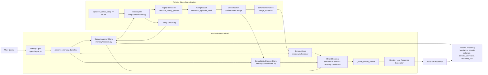
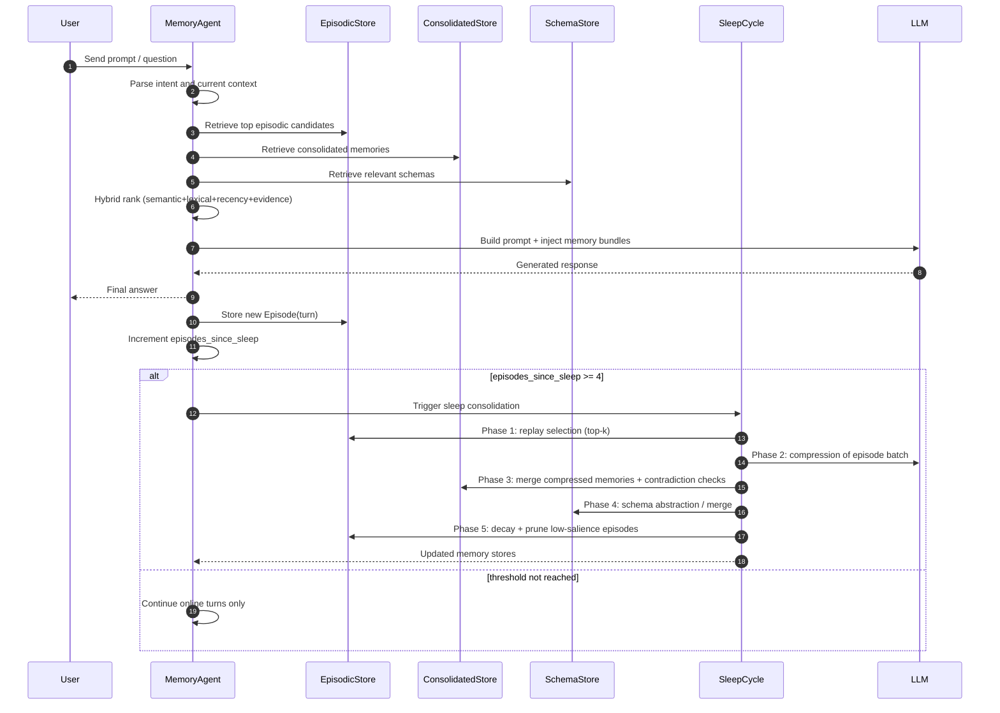
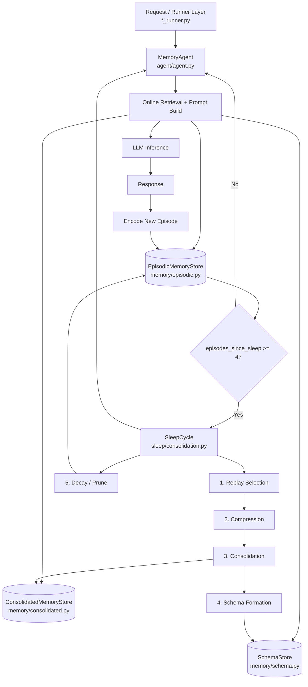

# Workflow Diagrams Draft

## 1) Perspective A — System Architecture (Implementation-Oriented)

---

## 2) Perspective B — Temporal Workflow (Per Turn + Sleep Trigger)

---

## 3) Perspective C — Simple Backend Architecture (Vertical)

